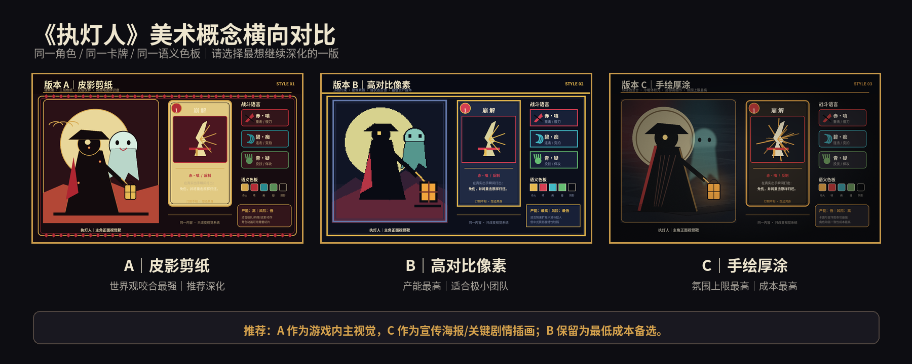
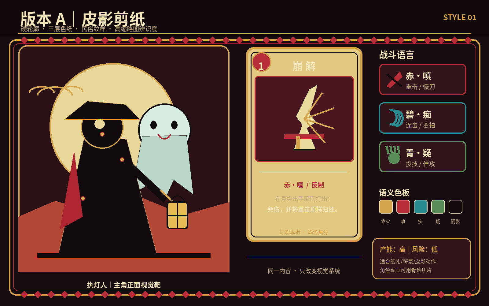
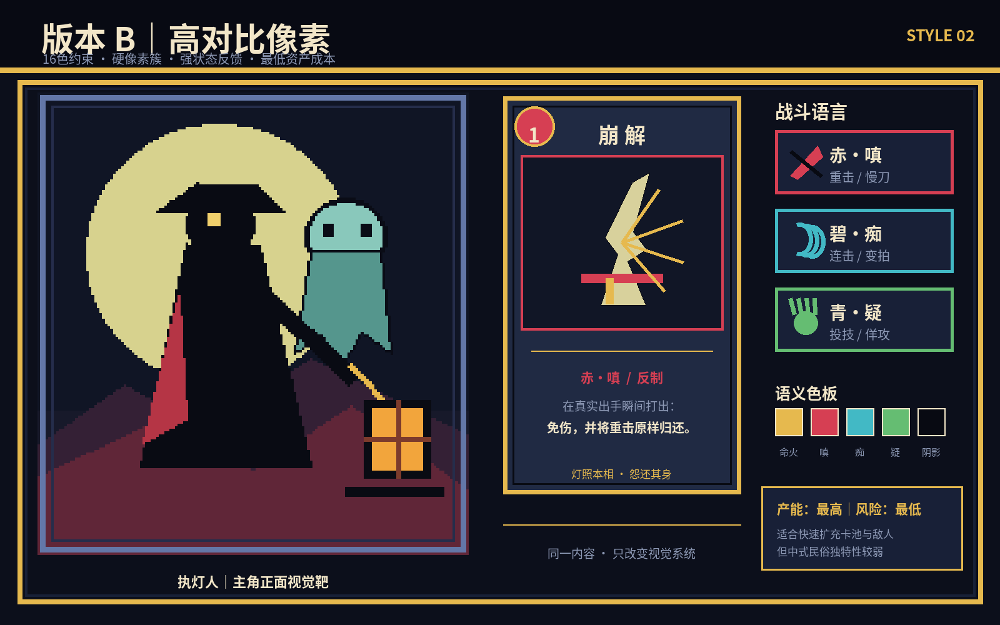
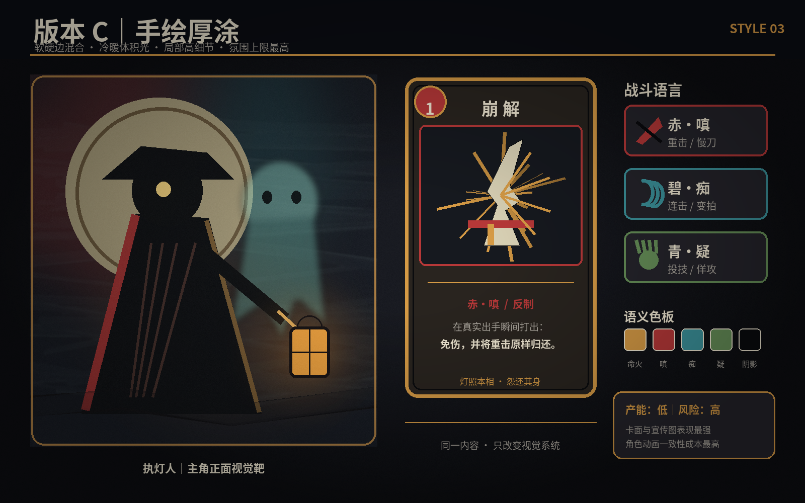

# 美术方向规范 v0.2

> 正式方向：C 手绘厚涂。概念板用于锁定光色、边缘和构图，不是最终生产资产。

## 技术框架

- 引擎：Godot 4.7.2 Mono
- 目标平台：Windows PC，优先适配 Steam Deck
- 画面方向：2D 卡牌战斗，角色半身或全身剪影，卡牌 UI 为主要信息载体
- 概念板尺寸：单版 1600x1000，总览 1800x720
- 共同视觉靶：执灯人、统一防范接触帧、赤嗔/碧痴/青疑三色怨气
- 首要质量标准：缩略图辨识度、弹反状态可读性、资产家族一致性、单人产能

## 总览

## A：皮影剪纸

- 形状：大块几何剪影、细长关节、灯笼和斗笠作为不可丢失的身份锚点
- 边缘：硬切纸边，双层描边，装饰纹样只放在边框和稀有卡上
- 价值结构：黑色主体、米黄色月轮、赤色危险焦点，三到四个明度层级
- 材质：色纸、纸扎、皮影关节、烛火透光
- 动画：骨骼切片为主，关节铆钉和纸片弯曲可直接成为风格语言
- 优势：世界观咬合最强、Steam 缩略图独特、敌人可通过轮廓快速扩充
- 风险：若装饰纹样过多会牺牲战斗可读性；需避免把厉鬼做得过于可爱
- 生产评估：高产能、低技术风险

## B：高对比像素

- 形状：16 色内的硬像素簇，大面积纯色，角色在低分辨率下仍保留斗笠和灯笼
- 边缘：不抗锯齿，最近邻缩放，轮廓至少保持两像素宽
- 价值结构：深蓝黑背景、米黄月轮、三色状态使用高亮纯色
- 材质：不追求写实材质，以色块和少量抖动纹理区分纸、布、火
- 动画：逐帧或骨骼皆可，弹反火花和命中帧容易获得强反馈
- 优势：最高产能、最容易做大量卡牌和敌人、运行成本最低
- 风险：中式怪谈差异度弱于 A；若像素尺寸选择错误，后期资产会整体返工
- 生产评估：最高产能、最低技术风险

## C：手绘厚涂

- 形状：人物主体保持硬剪影，鬼影和环境使用软边、失边和雾化层次
- 边缘：焦点处硬边，环境与鬼气软边；卡面允许局部高细节
- 价值结构：深黑夜景、冷青鬼影、暖橙命火，依靠冷暖对比而非纯色块
- 材质：湿石、旧布、烟雾、烛火体积光
- 动画：角色动画需维持笔触和体积一致，难以低成本批量扩充
- 优势：宣传海报、剧情插画和卡面上限最高，恐怖氛围最强
- 风险：游戏内角色动画与卡面一致性成本最高；目前概念板只表达光色和边缘策略，不代表最终厚涂成图质量
- 生产评估：低产能、高美术风险

## 正式选择：C 手绘厚涂

A 和 B 只保留为历史对照，不混入正式资产。C 的执行原则不是“每处都画满”，而是用厚涂制造气氛、用硬边保护玩法可读性。

### 最终游戏画面应该是什么样

- 画幅：16:9 横屏。战场占上方约 70%，卡牌和资源 UI 占下方约 30%。
- 构图：执灯人在左下三分之一，敌人在右侧或中央；双方武器交点始终处于屏幕视觉中心附近。
- 光照：玩家灯笼投出小范围暖橙光，厉鬼由冷青月光或磷光勾边。场景其余 60% 到 70% 保持近黑。
- 价值层级：先读角色剪影，再读武器与攻击预兆，最后才读衣料、湿石和雾气细节。
- 笔触：背景使用宽、松、断裂的干湿笔触；人物脸、手、武器和卡牌使用收紧的硬边。焦点之外允许失边融入黑暗。
- 材质：湿石路反射灯火，旧布吸光，金属只在刃口出现窄高光，鬼体像雾中浸湿的宣纸。
- 人物：人体比例可信但略微拉长；执灯人脸藏在斗笠阴影内，只留一点暖色眼光。厉鬼避免完整正脸，用缺失、遮挡和不自然关节制造恐怖感。
- UI：卡框像磨损黑漆木与旧符纸，不使用厚重金边；文字保持代码原生渲染，不烘焙进插画。

### 三色攻击在厚涂中的表现

| 类型 | 画面语言 | 快慢刀表达 |
|------|----------|------------|
| 赤·嗔 | 浓稠暗红聚集在武器和肩部，释放时出现一道极窄白芯 | 慢刀蓄力时红色越聚越重，假释放点只闪暗红，真正出手才出现白芯 |
| 碧·痴 | 冷青色碎弧和重复残影，像水波连续拍岸 | 连击每一拍留下短残影，停顿拍让残影悬住不散 |
| 青·疑 | 灰绿色鬼手从暗处透视伸长，手掌比身体更清楚 | 佯攻时先隐藏手腕，确认投技后掌心符号瞬间显形 |

### 完美弹反关键帧

1. 接触前：环境声音与亮度轻微收束，武器交点成为全屏最清晰的位置。
2. 接触帧：120ms hit-stop，金白细线切开画面，墨裂从交点向外扩散，但不遮挡手牌。
3. 接触后：暖灯光短暂压回冷色鬼气，火星与符纸碎屑沿敌人攻击方向反向飞回。
4. 禁止：全屏长时间纯白、粒子遮住敌人身体或武器轮廓、每次弹反都使用同等幅度震屏。

### 首张正式视觉靶规格

- 内容：第一幕雨夜老街，执灯人对阵前任更夫，敌人正在释放赤·嗔慢刀。
- 镜头：轻微低机位侧视，双方全身可见，灯笼与刀刃形成对角线。
- 输出：2560x1440 无 UI 场景图，以及 1920x1080 带战斗 UI 合成图。
- 验收：缩到 960x540 时仍能立刻分辨玩家、敌人、慢刀类型和弹反接触点。
- 排除：动漫大眼、写实 3D 渲染感、满屏花纹、平均铺满细节、灰雾压平明度、武器被特效遮挡。

## 生成与复现

- 原图由项目自有脚本 `tools/render_concepts.py` 使用 Pillow 程序化绘制。
- 所有图像均为本项目新生成，无外部图像素材，无第三方角色或艺术家风格引用。
- 重新生成：`python3 tools/render_concepts.py`
